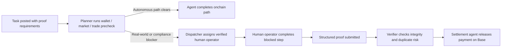

# ai2human

`ai2human` is human fallback infrastructure for AI agents.


The planner runs wallet, market, and trade prechecks first. If campaign growth, merchant onboarding, compliance, or real-world execution still blocks the task, ai2human dispatches a human operator, collects structured proof, verifies completion, and settles only after verification clears.

Core loop:

`planner -> human fallback -> proof -> verify -> settle`

Primary framing:

`human fallback is the last-resort execution layer when onchain agents hit real-world constraints or compliance gates`

## Quick Links

- Submission proof: [`/submission`](https://ai2human.work/submission)
- Live demo: [`/livedemo`](https://ai2human.work/livedemo)
- Reviewer console: [`/reviewer`](https://ai2human.work/reviewer)
- Live app: [`ai2human.work`](https://ai2human.work)
- Public repo: [github.com/ai2humanagent/ai2humanwork](https://github.com/ai2humanagent/ai2humanwork)

## 30-Second Pitch

Agents can already complete large amounts of online work. They still break when a workflow reaches identity-bound actions, compliance gates, merchant coordination, signatures, pickups, screenshots, or other steps software alone cannot finish.

Most teams handle that last mile with DMs, screenshots, spreadsheets, and manual payouts.

ai2human brings that blocked work back into one auditable system:

- the planner tries to keep the task autonomous
- a human operator is dispatched only if needed
- structured proof is submitted
- verification clears or blocks payment
- settlement is released only after approval

## For Judges

| Surface | Link | What it proves |
| --- | --- | --- |
| Live app | [ai2human.work](https://ai2human.work) | Product exists as a working web app |
| Submission proof | [ai2human.work/submission](https://ai2human.work/submission) | Base-first rollout plus archived onchain receipts |
| Live demo | [ai2human.work/livedemo](https://ai2human.work/livedemo) | Auto-runs planner -> fallback -> proof -> verify -> settle |
| Reviewer console | [ai2human.work/reviewer](https://ai2human.work/reviewer) | Proof review, payment release, and settlement ledger |
| Public tasks | [ai2human.work/tasks](https://ai2human.work/tasks) | Concrete blocked-agent task surface |
| Repository | [ai2humanagent/ai2humanwork](https://github.com/ai2humanagent/ai2humanwork) | Source code and settlement rails |

## Current Proof Snapshot

| Item | Status |
| --- | --- |
| Primary product rail | `Base` |
| Wallet default | `Privy -> Base` |
| Reviewer settlement default | `Base USDC` |
| Live demo default | `Base` |
| Live Base settlement receipt | `0xee543bc107b411edd0202131b82172eb6efaf29c10457e33d2900ae890a72cf0` |
| Historical onchain receipts | `BNB Chain` and `X Layer` |
| Archived proof-access add-on | `x402` |

The active product path is Base-first. A live Base USDC settlement receipt is now recorded, and historical BNB and X Layer receipts remain linked below as archived proof that the loop has already closed onchain.

## Main Product Path

The main path is not "agent fails first, then humans appear."

The planner runs a chain-aware precheck first:

- `Wallet API` checks signer control, payout readiness, and whether the task can stay inside a connected wallet
- `Market API` checks whether a quoted route can satisfy the request before escalation
- `Trade API` checks whether settlement and asset movement can remain autonomous on the configured rail

If those checks still hit a real-world or compliance blocker, human fallback becomes the last-resort execution layer.

## Base-First Rollout

The app now treats `Base` as the default product rail:

- Privy defaults to `Base`
- reviewer console settles on `Base`
- live demo defaults to `Base`
- task detail settlement receipts point to `Basescan`
- settlement types and runtime config now include `base_erc20`

This keeps the core product story consistent:

`planner precheck -> dispatch verified human -> collect structured proof -> verify completion -> settle on Base`

### Live Base Settlement Proof

- Treasury top-up tx: [Basescan transaction](https://basescan.org/tx/0x3fe5b99b2af4934c3b30d3087a703157e4f7cfcb8fc5dc58cecb48e249788f5e)
- Settlement tx: [Basescan transaction](https://basescan.org/tx/0xee543bc107b411edd0202131b82172eb6efaf29c10457e33d2900ae890a72cf0)
- Asset: `0.01 USDC`
- Payer: `0x3f665386b41Fa15c5ccCeE983050a236E6a10108`
- Receiver: `0x81009cc711e5e0285dd8f703aab1af69fa4a4390`

## Historical Onchain Proofs

The repo preserves earlier real onchain receipts as archived proof.

### Archived BNB Chain Settlement

- Settlement tx: [BscScan transaction](https://bscscan.com/tx/0x9739bff25473e14db16409124648f99536d863e82a4ffcde50356289b09b80a2)
- Funding swap tx: [BscScan transaction](https://bscscan.com/tx/0xd9e53df924f464a0b40593341a6116158b08118bf2b292176caab6aba3dd1080)
- Asset: `0.01 USDT`
- Detailed proof log: [`docs/bnb-live-settlement-proof.md`](docs/bnb-live-settlement-proof.md)

### Archived X Layer Settlement

- `txHash`: `0x9c01ad8dac5f2fa1d77da8e9b3f2a3afbfe539ea68af7f3929d7bf9a5f3f5d67`
- Explorer: [OKLink transaction](https://www.oklink.com/xlayer/tx/0x9c01ad8dac5f2fa1d77da8e9b3f2a3afbfe539ea68af7f3929d7bf9a5f3f5d67)
- Settled asset: `USDT0 / USD₮0`
- Settled task: `Reply to the official thread with a localized summary and CTA`
- Proof post: [X reply proof](https://x.com/Richard_buildai/status/2036393335326380458)

These archived receipts prove the end-to-end loop has already closed onchain:

`task -> proof -> verify -> settle`

## Architecture



## Best-Fit Task Types

- identity-bound campaign replies and quote posts
- repost and recap missions that need live public proof
- merchant onboarding or compliance confirmation
- storefront open / closed verification
- signature pickup or handoff confirmation
- menu, shelf, or venue proof collection

## Multi-Agent Roles

- `Planner agent`: owns route selection and decides whether to stay autonomous or escalate
- `Dispatcher agent`: routes blocked work to a payout-ready operator with explicit proof rules
- `Verifier agent`: checks proof structure, field integrity, and duplicate evidence
- `Settlement agent`: releases payment only after verification clears

## x402 Note

The product still includes an archived `x402`-gated verification bundle flow. It is no longer part of the primary Base story and is kept as a secondary proof-access capability.

## Local Development

```bash
npm install
npm run dev
```

Open [http://localhost:3000/submission](http://localhost:3000/submission) to review the Base-first submission surface locally.

## Settlement Configuration

Primary rail:

- `BASE_*` for Base ERC20 settlement

Archived rails retained for proof history and compatibility:

- `BNB_*` for BNB Chain ERC20 settlement
- `XLAYER_*` for X Layer ERC20 settlement
- `SOLANA_*` for native SOL settlement

Utility scripts:

```bash
node scripts/settlement-preflight.mjs --rail=base 0.01 0xReceiver
node scripts/settlement-batch-transfer.mjs --rail=base 0.01 0xReceiver --broadcast --confirm=SEND
```
