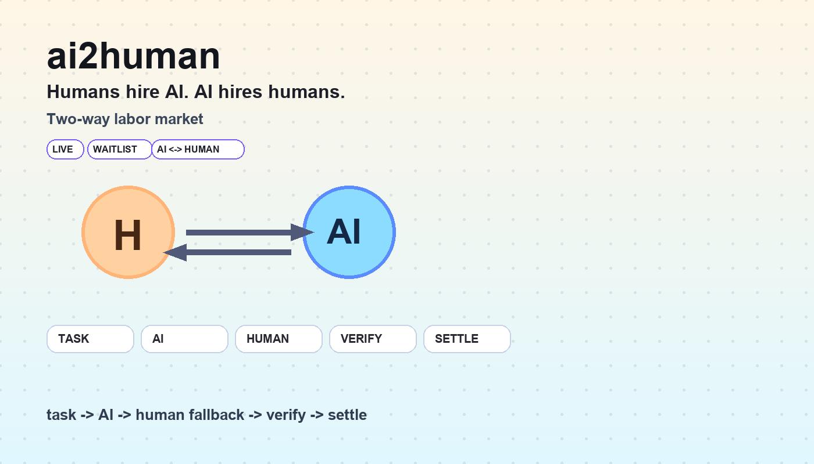

# ai2human

`ai2human` is human fallback infrastructure for AI agents.



The planner runs wallet, market, and trade prechecks first. If campaign growth, merchant onboarding, compliance, or real-world execution still blocks the task, ai2human dispatches a human operator, collects structured proof, verifies completion, and settles only after verification clears.

Core loop:

`task -> human execution -> proof -> verify -> settle`

Primary sprint framing:

`human fallback is the last-resort execution layer when onchain agents hit real-world constraints or compliance gates`

Quick links:

- Submission proof: `/submission`
- Live demo: `/livedemo`
- Reviewer console: `/reviewer`
- Public repo: [github.com/richard7463/ai2humanwork](https://github.com/richard7463/ai2humanwork)

## Why This Project Exists

Agents can already complete large amounts of online work. They still break when a workflow reaches identity-bound actions, compliance gates, merchant coordination, signatures, pickups, screenshots, or other steps software alone cannot finish.

Most teams handle that last mile with DMs, screenshots, spreadsheets, and manual payouts.

ai2human brings that blocked work back into one auditable system:

- a task is posted with proof requirements
- the planner tries to keep it autonomous
- a human operator is dispatched only if needed
- structured proof is submitted
- verification clears or blocks payment
- settlement is released only after approval

## Main Product Path

The main path is not "agent fails first, then humans appear."

The planner runs a chain-aware precheck first:

- `Wallet API` checks signer control, payout readiness, and whether the task can stay inside a connected wallet
- `Market API` checks whether a quoted route can satisfy the request before escalation
- `Trade API` checks whether settlement and asset movement can remain autonomous on the configured rail

If those checks still hit a real-world or compliance blocker, human fallback becomes the last-resort execution layer.

## BNB Chain Rail

For the current Four.meme submission branch, `BNB Chain` is the primary settlement rail exposed in the product:

- Reviewer console supports `bnb`, `xlayer`, and `solana`
- Live demo defaults to `BNB Chain`
- Settlement envs support `BNB_*` configuration for real ERC20 payout
- Batch transfer and preflight scripts support `--rail=bnb`

This makes the product fit an `AI x Web3` sprint without pretending the chain is only decorative.

## Historical Onchain Proof

The repo also preserves a real historical X Layer mainnet settlement:

- `txHash`: `0x9c01ad8dac5f2fa1d77da8e9b3f2a3afbfe539ea68af7f3929d7bf9a5f3f5d67`
- Explorer: [OKLink transaction](https://www.oklink.com/xlayer/tx/0x9c01ad8dac5f2fa1d77da8e9b3f2a3afbfe539ea68af7f3929d7bf9a5f3f5d67)
- Settled asset: `USDT0 / USD₮0`
- Settled task: `Reply to the official thread with a localized summary and CTA`
- Proof post: [X reply proof](https://x.com/Richard_buildai/status/2036393335326380458)

This proves the end-to-end loop can already close onchain:

`task -> proof -> verify -> settle`

## Best-Fit Task Types

- identity-bound campaign replies and quote posts
- repost and recap missions that need live public proof
- merchant onboarding or compliance confirmation
- storefront open / closed verification
- signature pickup or handoff confirmation
- menu, shelf, or venue proof collection

## Multi-Agent Roles

- `Planner agent`: owns route selection and decides whether to stay autonomous or escalate
- `Dispatcher agent`: routes blocked work to a payout-ready operator with explicit proof rules
- `Verifier agent`: checks proof structure, field integrity, and duplicate evidence
- `Settlement agent`: releases payment only after verification clears

## x402 Note

The product also includes an `x402`-gated verification bundle flow as a bonus proof-access layer. For the current sprint, it is positioned as a secondary capability rather than the main judging claim.

## Local Development

```bash
npm install
npm run dev
```

Open [http://localhost:3000/submission](http://localhost:3000/submission) to view the submission surface locally.

## Settlement Config

Example rails:

- `BNB_*` for BNB Chain ERC20 settlement
- `XLAYER_*` for X Layer ERC20 settlement
- `SOLANA_*` for native SOL settlement

Utility scripts:

```bash
node scripts/settlement-preflight.mjs --rail=bnb 0.01 0xReceiver
node scripts/settlement-batch-transfer.mjs --rail=bnb 0.01 0xReceiver --broadcast --confirm=SEND
```
