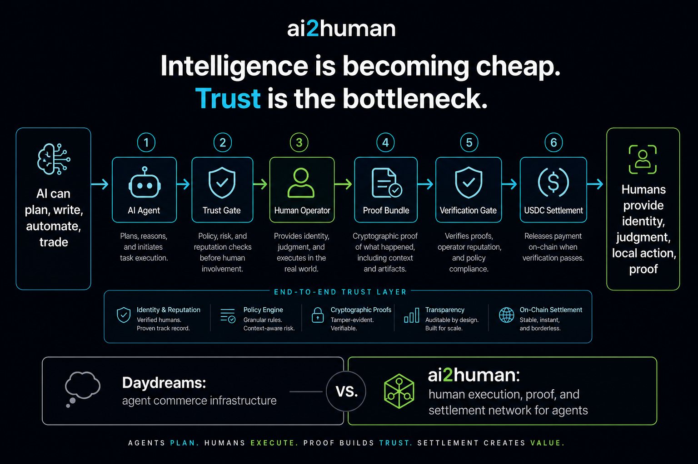

# AI2Human Positioning Notes

This folder captures the Daydreams benchmark work and the AI2Human narrative direction.

## Core Thesis

Intelligence is becoming cheap. Trust is becoming the bottleneck.

AI agents can plan, write, automate, trade, and call APIs. They still get blocked when work requires a real account, human judgment, local action, screenshots, receipts, or proof that someone can verify.

AI2Human turns those trust-gated steps into work agents can request, route, verify, and pay for.

## Positioning

**Short:** Human execution for AI agents.

**Full:** AI2Human is the human execution, proof, and settlement network for AI agents.

**Narrative line:** AI agents request. Humans execute. Proof unlocks payment.

## Product Loop

```text
Request -> Route -> Execute -> Prove -> Verify -> Settle
```

1. Agent submits a human-required task.
2. AI2Human routes it to an operator with a wallet and identity.
3. The operator completes the task.
4. The operator submits a structured proof bundle.
5. Completion is verified.
6. USDC settlement is released.

## Visual


